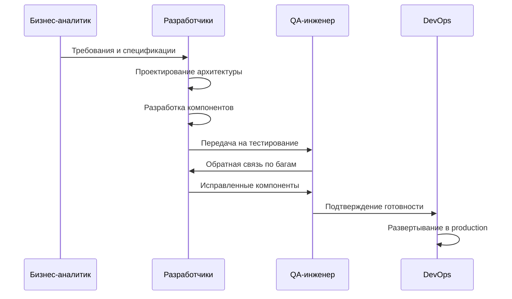
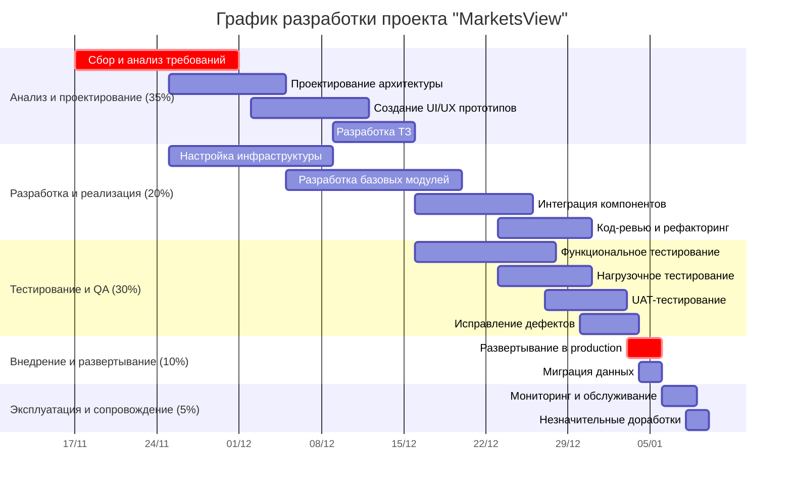

# **Отчет по управлению проектом "WebBlog": Этап планирования. Часть 2. План разработки программного продукта**

### **1. Процесс разработки программного обеспечения**
Применяется гибридная методология (Scrum + Waterfall), сочетающая предсказуемость waterfall в планировании с гибкостью Scrum в реализации.

*Таблица 1.1 - Этапы разработки программного обеспечения*
| Этап | Сроки | Основные задачи | Результаты |
|------|-------|----------------|------------|
| Инициирование и планирование | 17.01-15.03.2026 | • Формализация требований • Оценка рисков • Формирование команды • Утверждение плана | Устав проекта, WBS, план управления |
| Проектирование системы | 16.03-31.05.2026 | • Проектирование архитектуры • Создание UI/UX макетов • Проектирование БД • Разработка API спецификаций | Техническое задание, архитектурные диаграммы, макеты |
| Реализация | 01.06-15.09.2026 | • Frontend-разработка • Backend-разработка • Интеграция компонентов • Модульное тестирование | Рабочий прототип, документация кода |
| Тестирование | 16.09-31.10.2026 | • Интеграционное тестирование • Нагрузочное тестирование • Пользовательское тестирование • Исправление ошибок | Отчеты о тестировании, готовый продукт |
| Внедрение | 01.11-12.12.2026 | • Промышленное развертывание • Миграция данных • Обучение пользователей • Техническая поддержка | Рабочая система, пользовательская документация |

### **2. Документация проекта**
Комплекс документации охватывает все этапы жизненного цикла проекта:

- Техническое задание (бизнес-требования, функциональные требования, нефункциональные требования, ограничения, критерии приемки)

- Архитектурная документация (концептуальные диаграммы, логические схемы, диаграммы прецедентов, диаграммы последовательностей, C4-диаграммы)

- Пользовательские руководства (руководство администратора, руководство пользователя, инструкции по работе с системой)

- API документация (спецификации endpoints, примеры запросов/ответов, коды ошибок)

- Отчеты о тестировании (тест-планы, тест-кейсы, отчеты о дефектах, отчеты о приемочных испытаниях)

В итоге документация обеспечивает прозрачность разработки и облегчает поддержку продукта.

### **3. Диаграмма последовательности разработки**

### **4. Диаграмма Ганта**

### **5. Контроль качества на каждом этапе**

Планирование качества

- Определение стандартов и метрик

- Создание чек-листов проверок

- Установление критериев приемки

Процессные проверки

- Регулярные код-ревью

- Статический анализ кода

- Проверка соответствия стандартам

Функциональное тестирование

- Модульное тестирование (Jest, Karma)

- Интеграционное тестирование

- Регрессионное тестирование

Нефункциональное тестирование

- Нагрузочное тестирование (JMeter)

- Тестирование безопасности

- Тестирование совместимости

Приемочное тестирование

- Тестирование пользователями

- Проверка критериев приемки

В итоге многоуровневая система контроля обеспечивает высокое качество продукта.

### **6. Управление версиями и релизами**
Внедрена система управления версиями на основе GitFlow:

- Система контроля версий: Git (GitHab)

- Модель ветвления: GitFlow (main, develop, feature/, release/, hotfix/)

- Частота релизов: Каждые 2 недели (agile-циклы)

- Процесс выпуска:

  - Разработка в feature-ветках

  - Слияние в develop после код-ревью

  - Создание release-ветки для стабилизации

  - Слияние в main с тегированием версий

  - Развертывание через CI/CD пайплайны
  
Таким образом, процесс управления версиями обеспечивает стабильность и контроль изменений.

### **7. Проблемы планирования и рекомендации**
Выявлены ключевые проблемы и разработаны рекомендации:

- Технические сложности (интеграция компонентов, производительность)
Рекомендации: Прототипирование, нагрузочное тестирование на ранних этапах

- Управленческие вызовы (изменение требований, распределение команды)
Рекомендации: Гибкая методология, регулярная коммуникация, четкое распределение ролей

- Внешние факторы (изменение законодательства, рыночные условия)
Рекомендации: Регулярный мониторинг внешней среды, создание буферов в плане

- Методологические проблемы (сочетание waterfall и agile подходов)
Рекомендации: Четкое разграничение этапов, адаптация процессов под проект
В итоге проактивное планирование позволяет минимизировать влияние потенциальных проблем.

### **8. Заключение**
Разработан детализированный план разработки программного продукта проекта "WebBlog". Определены процессы разработки, документация и методы контроля качества. Внедрена система управления версиями и планирования релизов. Выявлены потенциальные проблемы и разработаны рекомендации по их решению. План обеспечивает стандартизацию процессов и предсказуемость результатов разработки. Результаты этапа служат основой для перехода к фазе реализации проекта.
