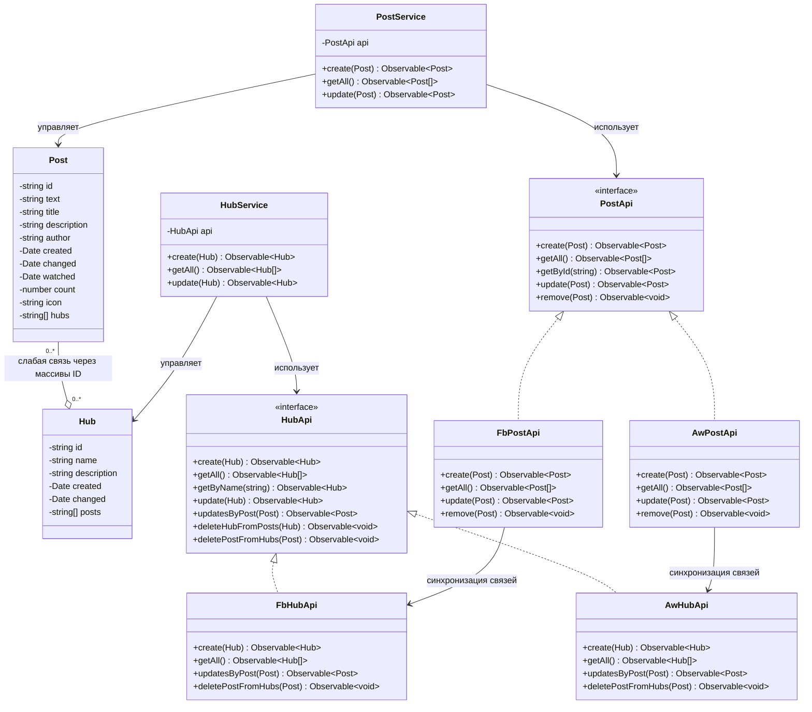
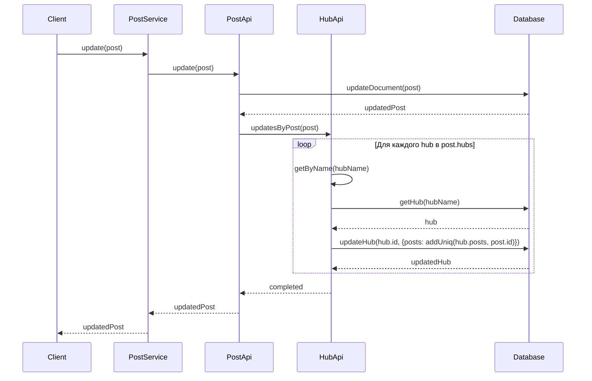

# Модели данных: Post и Hub

## Описание моделей

### Post (Статья)

Модель представляет собой статью блога с полным содержимым и метаданными.

```typescript
interface Post {
    id?: string;              // Уникальный идентификатор
    text: string;             // Содержимое статьи (Delta формат Quill)
    title: string;            // Заголовок статьи
    description: string;      // Краткое описание для превью
    author: string;           // Автор статьи
    created?: Date;           // Дата создания
    changed?: Date;           // Дата последнего изменения
    watched?: Date;           // Дата последнего просмотра
    count?: number;           // Счётчик просмотров
    icon?: string;            // URL иконки/превью
    hubs?: string[];          // Массив ID хабов (слабая связь)
}
```

**Ключевые поля:**
- `text` - хранит содержимое в формате Delta (Quill 1.x), что позволяет сохранять форматирование
- `hubs` - массив строковых идентификаторов хабов, к которым относится статья

### Hub (Хаб/Категория)

Модель представляет категорию или тематический раздел блога.

```typescript
interface Hub {
    id?: string;              // Уникальный идентификатор
    name: string;             // Название хаба
    description?: string;     // Описание хаба
    created?: Date;           // Дата создания
    changed?: Date;           // Дата последнего изменения
    posts?: string[];         // Массив ID постов (слабая связь)
}
```

**Ключевые поля:**
- `name` - уникальное название хаба (используется для поиска)
- `posts` - массив строковых идентификаторов постов, принадлежащих этому хабу

## Тип связи: слабая связь через массивы

### Архитектура связи

Связь между `Post` и `Hub` реализована как **двунаправленная слабая связь** через массивы идентификаторов:

```
Post.hubs: string[]  ←→  Hub.posts: string[]
```

**Особенности:**
1. **Двунаправленность**: Каждый пост хранит массив ID хабов, каждый хаб хранит массив ID постов
2. **Слабая связь**: Нет жестких foreign key constraints, как в реляционных БД
3. **Массивы ID**: Связь реализована через простые массивы строковых идентификаторов
4. **Синхронизация**: При изменении связей обновляются оба массива через методы API

### Механизм синхронизации

При создании или обновлении поста с указанными хабами:

1. **Post → Hub**: Метод `updatesByPost(post)` обновляет массив `posts` в каждом указанном хабе
2. **Hub → Post**: При удалении хаба метод `deleteHubFromPosts(hub)` удаляет ID хаба из всех связанных постов
3. **Post → Hub**: При удалении поста метод `deletePostFromHubs(post)` удаляет ID поста из всех связанных хабов

**Пример кода синхронизации:**
```typescript
// При обновлении поста
update(post: Post): Observable<Post> {
    // 1. Обновляем сам пост
    return updateDocument(post).pipe(
        // 2. Синхронизируем связи в хабах
        switchMap((post) => this.hubApi.updatesByPost(post))
    );
}

// Метод синхронизации в Hub API
updatesByPost(post: Post): Observable<Post> {
    return from(post.hubs).pipe(
        concatMap(hubName => this.getByName(hubName)),
        switchMap(hub => this.update(hub.id, { 
            posts: addUniq(hub.posts, post.id) 
        }))
    );
}
```

## Преимущества отсутствия жесткой реляционной связи

### 1. **Гибкость и простота**

- ✅ **Нет ограничений внешних ключей**: Можно легко добавлять/удалять связи без проверок целостности на уровне БД
- ✅ **Простота миграции**: Легко переносить данные между разными БД (Firebase → AppWrite)
- ✅ **Отсутствие каскадных удалений**: Удаление поста или хаба не требует автоматического каскадного удаления

### 2. **Производительность**

- ✅ **Нет JOIN операций**: Все данные доступны напрямую, без сложных запросов
- ✅ **Быстрое чтение**: Массивы ID позволяют быстро получить список связанных сущностей
- ✅ **Оптимизация запросов**: Можно загружать только необходимые данные

### 3. **Масштабируемость**

- ✅ **NoSQL совместимость**: Идеально подходит для документных БД (Firebase, AppWrite, MongoDB)
- ✅ **Горизонтальное масштабирование**: Легко распределять данные по шардам
- ✅ **Независимость коллекций**: Посты и хабы могут храниться в разных коллекциях/таблицах

### 4. **Устойчивость к ошибкам**

- ✅ **Частичная синхронизация**: Если синхронизация не удалась, данные остаются частично связанными
- ✅ **Восстановление**: Можно легко восстановить связи через методы `linkedAll()` и `clearLinks()`
- ✅ **Отсутствие блокировок**: Нет транзакций и блокировок, которые могут привести к deadlock

### 5. **Простота разработки**

- ✅ **Минимум кода**: Не нужно создавать промежуточные таблицы связей (many-to-many)
- ✅ **Понятная структура**: Связи видны непосредственно в модели данных
- ✅ **Легкое тестирование**: Просто мокировать массивы ID

### Недостатки (и как они компенсируются)

- ⚠️ **Ручная синхронизация**: Требуется явная синхронизация при изменениях
  - **Решение**: Методы API автоматически синхронизируют связи
  
- ⚠️ **Возможная рассинхронизация**: При ошибках связи могут стать неконсистентными
  - **Решение**: Методы `linkedAll()` и `clearLinks()` для восстановления целостности

- ⚠️ **Дублирование данных**: ID хранятся в двух местах
  - **Решение**: Это компенсируется простотой и производительностью чтения

## UML диаграмма компонентов



## Диаграмма последовательности: обновление поста с синхронизацией хабов



## Заключение

Архитектура слабой связи через массивы ID обеспечивает:
- **Гибкость** при работе с NoSQL базами данных
- **Производительность** за счет отсутствия JOIN операций
- **Простота** реализации и поддержки
- **Масштабируемость** для роста данных

Синхронизация связей происходит автоматически через методы API, что гарантирует консистентность данных при нормальной работе системы.

