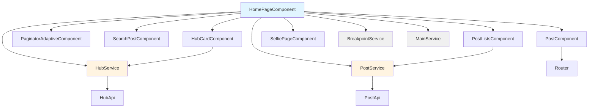
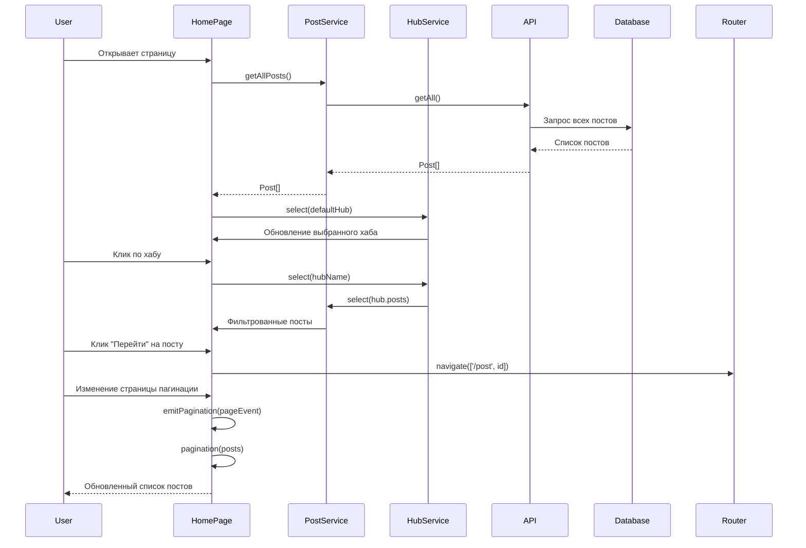

# Пользовательские возможности главной страницы

## Обзор

Главная страница блога (`/home`) предоставляет пользователям комплексный интерфейс для просмотра каталога статей, навигации по контенту и фильтрации материалов. Интерфейс адаптирован для различных типов устройств: десктоп, планшет и мобильные устройства.

## Основные возможности

### 1. Просмотр каталога статей

**Описание:**
Центральная область страницы отображает каталог статей с превью каждой записи.

**Функциональность:**
- ✅ **Отображение списка постов**: Показ статей в виде карточек с превью
- ✅ **Превью контента**: Каждая карточка содержит:
  - Иконку/изображение поста (если доступно)
  - Заголовок статьи
  - Краткое описание (`description`)
  - Автора статьи
  - Список хабов (категорий), к которым относится пост
  - Обрезанный текст статьи (адаптивно по ширине контейнера)
- ✅ **Индикатор загрузки**: Показ скелетонов постов во время загрузки данных

**Технические детали:**
- Компонент: `app-post` (используется в цикле `*ngFor`)
- Данные: Массив `selected: Post[]` - текущая страница пагинации
- Размер страницы: По умолчанию 5 постов, настраивается через пагинатор

### 2. Пагинация

**Описание:**
Пагинатор позволяет пользователю навигироваться по страницам каталога и настраивать количество отображаемых постов.

**Функциональность:**
- ✅ **Переключение страниц**: Кнопки "Первая", "Предыдущая", "Следующая", "Последняя"
- ✅ **Настройка размера страницы**: Выбор количества постов на странице (5, 10, 25, 100)
- ✅ **Информация о странице**: Отображение диапазона постов (например, "1 - 5 из 100")
- ✅ **Адаптивное отображение**: На мобильных устройствах скрывается текстовая информация

**Параметры:**
- Размер страницы по умолчанию: `5`
- Доступные размеры: `[5, 10, 25, 100]`
- Показ пагинатора: Автоматически при приближении к нижней части страницы

**Компонент:** `app-paginator-adaptive`

### 3. Фильтрация по хабам (категориям)

**Описание:**
Правая панель содержит карточку текущего выбранного хаба с возможностью фильтрации постов.

**Функциональность:**
- ✅ **Отображение текущего хаба**: Показ информации о выбранном хабе
  - Название хаба
  - Описание (с возможностью развернуть/свернуть для длинных описаний)
  - Количество постов в хабе
- ✅ **Фильтрация постов**: Переключение фильтра показывает только посты, принадлежащие выбранному хабу
- ✅ **Автовыбор**: При загрузке страницы автоматически выбирается первый хаб из первого поста

**Взаимодействие:**
- Клик по кнопке с количеством постов включает/выключает фильтр
- При включении фильтра показываются только посты из массива `hub.posts`
- При выключении показываются все посты

**Компонент:** `app-hub-card`

### 4. Поиск по статьям

**Описание:**
Компонент поиска позволяет пользователю искать статьи по различным критериям.

**Текущая реализация:**
- ✅ **Поле ввода**: Текстовое поле для ввода поискового запроса
- ✅ **Фильтр по дате**: Выбор даты для фильтрации статей
  - Предустановленные периоды: "за 3 дня", "за неделю", "за месяц"
  - Выбор конкретной даты через datepicker
- ✅ **Фильтр "Избранное"**: Кнопка для показа только помеченных статей (в разработке)

**Состояния компонента:**
- `focused` - поле в фокусе
- `typing` - пользователь вводит текст
- `searching` - выполняется поиск
- `hasValue` - в поле есть текст

**Компонент:** `app-search-post`

**Примечание:** Полноценная реализация поиска находится в разработке. Текущая версия содержит UI-компоненты и базовую логику.

### 5. Списки постов

**Описание:**
В правой панели отображаются дополнительные списки постов для быстрой навигации.

**Функциональность:**
- ✅ **Недавние посты** (`recent`): Список последних опубликованных статей
- ✅ **Популярные посты** (`popular`): Список наиболее просматриваемых статей
- ✅ **Компактное отображение**: Каждый список показывает:
  - Заголовок (обрезанный до 24-28 символов в зависимости от устройства)
  - Автора (сокращенное имя: "И. И. Иванов")
  - Адаптивная длина текста в зависимости от размера экрана

**Компонент:** `app-post-lists` (используется 3 раза для разных списков)

### 6. Переход к статье

**Описание:**
Пользователь может перейти к полной версии статьи, кликнув на карточку поста.

**Функциональность:**
- ✅ **Кнопка "Перейти"**: На каждой карточке поста
- ✅ **Навигация**: Переход на страницу `/post/:id` для просмотра полной статьи
- ✅ **Клик по хабу**: Клик по тегу хаба на карточке поста переключает фильтр на этот хаб

**Маршрутизация:**
```typescript
postClick(id: number) {
  this.router.navigate(['/post', id]);
}
```

### 7. Адаптивный дизайн

**Описание:**
Интерфейс адаптируется под различные размеры экранов и типы устройств.

**Типы макетов:**
- **Desktop** (широкий экран): 3 колонки (профиль, посты, панель управления)
- **Middle** (средний экран): 3 колонки с уменьшенными отступами
- **Narrow** (узкий экран): 2 колонки (профиль и посты, панель скрыта)
- **Tablet** (планшет): 1 колонка (только посты)
- **Mobile** (мобильный): 1 колонка (только посты)

**Адаптивные элементы:**
- Скрытие/показ правой панели в зависимости от размера экрана
- Изменение размера текста и количества символов в превью
- Адаптивная пагинация (скрытие текста на мобильных)
- Автоматическое определение touch-устройств

**Сервис:** `BreakpointService` - отслеживает изменения размера экрана и переключает layout

## Структура интерфейса

### Левая панель (Desktop/Middle)
- **Профиль автора** (`app-selfie-page`): Информация об авторе блога
- **Декоративный элемент "code"**: Визуальный элемент для широких экранов

### Центральная область
- **Каталог постов**: Основной контент - список статей
- **Пагинация**: Внизу страницы (появляется при прокрутке)

### Правая панель (Desktop/Middle/Narrow)
- **Панель управления** (`tune-panel`):
  - Поиск (`app-search-post`)
  - Карточка хаба (`app-hub-card`)
- **Списки постов** (`app-post-lists`):
  - Недавние посты
  - Популярные посты
  - Дополнительные списки

## Будущие возможности

### Планируемые функции фильтрации

1. **Расширенный поиск**
   - Поиск по содержимому статьи (текст, заголовок, описание)
   - Поиск по автору
   - Комбинированные фильтры (дата + текст + хаб)

2. **Фильтр по дате**
   - ✅ UI готов (datepicker)
   - ⏳ Реализация логики фильтрации

3. **Фильтр "Избранное"**
   - ✅ UI готов (кнопка "Избранное")
   - ⏳ Интеграция с системой закладок пользователя

4. **Сортировка**
   - По дате создания (новые/старые)
   - По количеству просмотров
   - По дате изменения
   - По алфавиту (заголовок)

5. **Множественный выбор хабов**
   - Фильтрация по нескольким хабам одновременно
   - Исключение хабов из результатов

6. **Теги и метки**
   - Система тегов для дополнительной категоризации
   - Фильтрация по тегам

7. **Персональные настройки**
   - Сохранение предпочтений фильтрации
   - История поисковых запросов
   - Избранные фильтры

### Улучшения UX

1. **Быстрая навигация**
   - Горячие клавиши для переключения фильтров
   - Быстрый переход к последнему просмотренному посту

2. **Визуальные улучшения**
   - Анимации переходов
   - Предпросмотр поста при наведении
   - Темная тема (UI готов, требуется интеграция)

3. **Социальные функции**
   - Поделиться статьей
   - Комментарии (в разработке)
   - Лайки (счетчик готов, UI в разработке)

## Диаграмма компонентов главной страницы



## Поток данных



## Заключение

Главная страница предоставляет пользователям полнофункциональный интерфейс для:
- ✅ Просмотра каталога статей
- ✅ Навигации по страницам
- ✅ Фильтрации по категориям (хабам)
- ✅ Поиска и фильтрации (базовая реализация)
- ✅ Быстрого доступа к популярным и недавним постам
- ✅ Адаптивного отображения на всех устройствах

Текущая реализация обеспечивает базовый функционал, а архитектура позволяет легко расширять возможности фильтрации и поиска в будущем.

