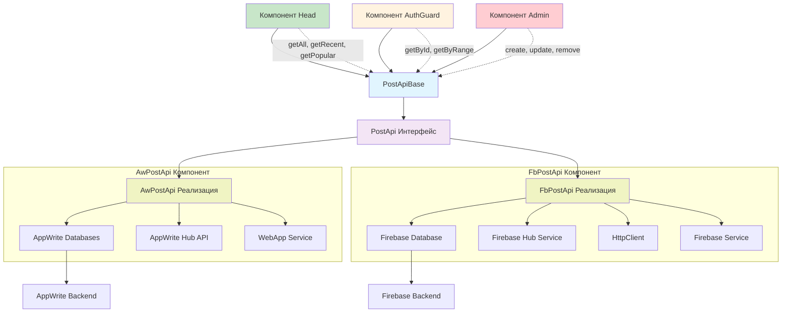

### Описание API в Angular модуле

**PostApi интерфейс - методы CRUD операций:**

**Базовые CRUD методы:**
- `create(post: Post): Observable<Post>` - создание новой статьи в Firestore
- `getAll(): Observable<Post[]>` - получение всех статей из коллекции Firestore
- `getById(id: string): Observable<Post>` - получение конкретной статьи по ID документа
- `update(post: Post | string, data?: {}): Observable<Post>` - обновление статьи в Firestore
- `remove(post: Post | string): Observable<void>` - удаление статьи из коллекции Firestore

**Специализированные методы:**
- `getRecent(): Observable<Post[]>` - получение недавних статей (сортировка по дате создания)
- `getPopular(): Observable<Post[]>` - получение популярных статей (сортировка по просмотрам/лайкам)
- `getByRange(ids: string[]): Observable<Post[]>` - получение статей по массиву ID документов
 
 

### Взаимодействие с Firebase

**Firestore структура:**
- Коллекция: `posts` - хранение всех статей
- Документ: `{postId}` - отдельная статья с полями (title, content, createdAt, views, etc.)
- Запросы: Firestore queries для фильтрации и сортировки

**Реализация методов в Firebase контексте:**
- `create()` - добавление документа в коллекцию `posts`
- `getAll()` - получение всей коллекции `posts`
- `getById()` - получение документа по `postId`
- `getRecent()` - запрос с сортировкой по `createdAt` desc
- `getPopular()` - запрос с сортировкой по `views` desc
- `getByRange()` - запрос с `where` условием по массиву ID
- `update()` - обновление документа по `postId`
- `remove()` - удаление документа по `postId`

**Паттерн проектирования:**
- `PostApi` - интерфейс абстракции
- `PostApiBase` - базовая реализация (декоратор/адаптер)
- Конкретная реализация - инжектируется через конструктор для Firebase/AppWrite

 
### Взаимодействие с AppWrite

**AppWrite структура:**
- База данных: `environment.webAppConfig.databaseId` - основная база данных
- Коллекция: `environment.webAppConfig.collections.posts` - коллекция статей
- Документ: `AwPostModel` - модель документа статьи с системными полями AppWrite

**Реализация методов в AppWrite контексте:**

**create()** - создание документа:
- `databases.createDocument()` - создание нового документа в коллекции posts
- `ID.unique()` - генерация уникального ID документа
- `postToDto(post)` - преобразование Post в DTO для AppWrite
- `['read("any")']` - установка прав доступа на чтение для всех пользователей
- `hubApi.updatesByPost(post)` - обновление связанных хабов

**getAll()** - получение всех статей:
- `databases.listDocuments()` - получение всех документов коллекции
- Сортировка по дате создания (`$createdAt`) в порядке убывания
- Преобразование `AwPostModel` в `Post` через `mapToPosts`

**getRecent()** - недавние статьи:
- Фильтрация через `getAll()` + `slice(0, 5)` - первые 5 статей
- Сортировка по дате создания (новые первыми)

**getPopular()** - популярные статьи:
- Фильтрация через `getAll()` + `slice(0, 5)` - первые 5 статей
- В текущей реализации аналогично getRecent()

**getById()** - получение статьи по ID:
- `databases.getDocument()` - получение конкретного документа по ID
- Валидация наличия ID перед запросом
- Преобразование `AwPostModel` в `Post` через `mapToPost`

**getByRange()** - получение статей по массиву ID:
- `combineLatest()` - параллельное выполнение запросов для каждого ID
- `databases.getDocument()` для каждого ID из массива
- Обработка случая пустого массива IDs

**update()** - обновление статьи:
- `databases.updateDocument()` - обновление существующего документа
- Поддержка двух форматов вызова: по объекту Post или по ID + data
- Автоматическое определение формата входных параметров
- `hubApi.updatesByPost(post)` - синхронизация с хабами

**remove()** - удаление статьи:
- `databases.deleteDocument()` - удаление документа из коллекции
- Предварительное получение данных статьи для синхронизации с хабами
- `hubApi.deletePostFromHubs(post)` - удаление ссылок из связанных хабов

**Особенности AppWrite реализации:**
- Использование системных полей AppWrite: `$id`, `$createdAt`, `$updatedAt`
- Автоматическая обработка разрешений через параметр permissions
- Интеграция с сервисом хабов через `AwHubApi`
- Преобразование данных между моделями через mapper-функции

