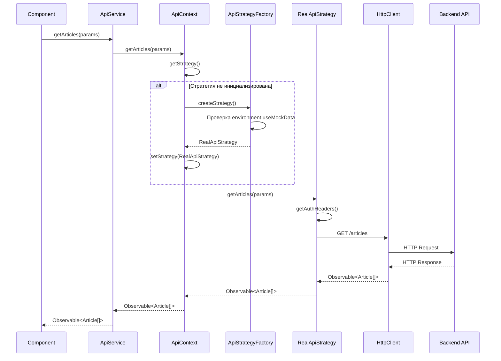

# Паттерн Strategy для управления источниками данных в WebBlog

## 1. Общее описание

В проекте WebBlog реализован **паттерн Strategy** для обеспечения гибкого переключения между различными источниками данных. Это решение позволяет динамически выбирать между реальным REST API и мок-данными в зависимости от контекста выполнения (разработка, тестирование, production).

### Цель применения паттерна

- **Гибкость переключения** между реальным API и мок-данными без изменения клиентского кода
- **Упрощение разработки** и тестирования без необходимости постоянного подключения к бэкенду
- **Отказоустойчивость** — возможность работы в аварийном режиме с мок-данными при недоступности API
- **Легкость расширения** — простое добавление новых стратегий (например, кэширование, GraphQL)

---

## 2. Архитектура решения

### 2.1. Компоненты системы

```
┌─────────────────────────────────────────────────────────┐
│                    Angular Application                  │
│                                                         │
│  ┌──────────────┐         ┌──────────────────────┐    │
│  │  Components  │─────────▶│    ApiService        │    │
│  │  (UI Layer)  │         │  (Angular Service)   │    │
│  └──────────────┘         └──────────┬───────────┘    │
│                                      │                 │
│                                      ▼                 │
│                            ┌──────────────────────┐    │
│                            │    ApiContext        │    │
│                            │  (Strategy Manager)  │    │
│                            └──────────┬───────────┘    │
│                                      │                 │
│                    ┌─────────────────┴─────────────────┐
│                    │                                   │
│                    ▼                                   ▼
│         ┌──────────────────┐          ┌──────────────────┐
│         │ ApiStrategy      │          │ ApiStrategy      │
│         │  (Interface)     │          │  (Interface)    │
│         └────────┬─────────┘          └────────┬────────┘
│                  │                             │
│         ┌────────┴─────────┐         ┌────────┴─────────┐
│         │                  │         │                  │
│         ▼                  ▼         ▼                  ▼
│  ┌──────────────┐  ┌──────────────┐ ┌──────────────┐  │
│  │RealApiStrategy│  │MockApiStrategy│ │CacheStrategy │  │
│  │               │  │               │ │  (future)    │  │
│  └──────────────┘  └──────────────┘ └──────────────┘  │
│         │                  │                            │
│         └──────────────────┴────────────────────────────┘
│                    │
│                    ▼
│         ┌──────────────────────┐
│         │ ApiStrategyFactory  │
│         │  (Strategy Creator) │
│         └──────────────────────┘
└─────────────────────────────────────────────────────────┘
```

### 2.2. Структура классов и интерфейсов

#### Интерфейс `ApiStrategy`

Базовый контракт для всех стратегий работы с данными.

```typescript
interface ApiStrategy {
  // Получение списка статей
  getArticles(params?: ArticleQueryParams): Observable<Article[]>;
  
  // Получение статьи по ID
  getArticleById(id: string): Observable<Article>;
  
  // Создание новой статьи
  createArticle(article: CreateArticleDto): Observable<Article>;
  
  // Обновление статьи
  updateArticle(id: string, article: UpdateArticleDto): Observable<Article>;
  
  // Удаление статьи
  deleteArticle(id: string): Observable<void>;
  
  // Поиск статей
  searchArticles(query: string): Observable<Article[]>;
  
  // Получение категорий
  getCategories(): Observable<Category[]>;
  
  // Аутентификация
  authenticate(credentials: AuthCredentials): Observable<AuthResponse>;
}
```

#### Класс `RealApiStrategy`

Реализация стратегии для работы с реальным REST API.

```typescript
@Injectable()
export class RealApiStrategy implements ApiStrategy {
  private readonly baseUrl = environment.apiUrl;
  
  constructor(
    private http: HttpClient,
    private authService: AuthService
  ) {}
  
  getArticles(params?: ArticleQueryParams): Observable<Article[]> {
    const headers = this.getAuthHeaders();
    const queryParams = this.buildQueryParams(params);
    
    return this.http.get<Article[]>(
      `${this.baseUrl}/articles`,
      { headers, params: queryParams }
    );
  }
  
  // ... остальные методы
  
  private getAuthHeaders(): HttpHeaders {
    const token = this.authService.getToken();
    return new HttpHeaders({
      'Authorization': `Bearer ${token}`,
      'Content-Type': 'application/json'
    });
  }
}
```

#### Класс `MockApiStrategy`

Реализация стратегии для работы с мок-данными (для разработки и тестирования).

```typescript
@Injectable()
export class MockApiStrategy implements ApiStrategy {
  private mockArticles: Article[] = [
    // Предопределенные тестовые данные
  ];
  
  getArticles(params?: ArticleQueryParams): Observable<Article[]> {
    return of(this.filterArticles(this.mockArticles, params))
      .pipe(delay(500)); // Имитация сетевой задержки
  }
  
  getArticleById(id: string): Observable<Article> {
    const article = this.mockArticles.find(a => a.id === id);
    return article 
      ? of(article).pipe(delay(300))
      : throwError(() => new Error('Article not found'));
  }
  
  // ... остальные методы с мок-данными
  
  private filterArticles(articles: Article[], params?: ArticleQueryParams): Article[] {
    // Логика фильтрации мок-данных
    return articles;
  }
}
```

#### Класс `ApiContext`

Контекст, управляющий текущей стратегией.

```typescript
@Injectable({
  providedIn: 'root'
})
export class ApiContext {
  private currentStrategy: ApiStrategy;
  
  constructor(
    private strategyFactory: ApiStrategyFactory
  ) {
    // Инициализация стратегии на основе конфигурации
    this.currentStrategy = this.strategyFactory.createStrategy();
  }
  
  // Установка стратегии
  setStrategy(strategy: ApiStrategy): void {
    this.currentStrategy = strategy;
  }
  
  // Получение текущей стратегии
  getStrategy(): ApiStrategy {
    return this.currentStrategy;
  }
  
  // Делегирование вызовов текущей стратегии
  getArticles(params?: ArticleQueryParams): Observable<Article[]> {
    return this.currentStrategy.getArticles(params);
  }
  
  getArticleById(id: string): Observable<Article> {
    return this.currentStrategy.getArticleById(id);
  }
  
  // ... остальные методы делегирования
}
```

#### Фабрика `ApiStrategyFactory`

Фабрика для создания стратегий на основе конфигурации.

```typescript
@Injectable({
  providedIn: 'root'
})
export class ApiStrategyFactory {
  constructor(
    private injector: Injector
  ) {}
  
  createStrategy(): ApiStrategy {
    const useMockData = environment.useMockData;
    const apiUrl = environment.apiUrl;
    
    // Переключение на основе переменных окружения
    if (useMockData || !apiUrl) {
      return this.injector.get(MockApiStrategy);
    }
    
    return this.injector.get(RealApiStrategy);
  }
  
  // Создание стратегии по типу
  createStrategyByType(type: 'real' | 'mock'): ApiStrategy {
    switch (type) {
      case 'mock':
        return this.injector.get(MockApiStrategy);
      case 'real':
      default:
        return this.injector.get(RealApiStrategy);
    }
  }
}
```

#### Angular сервис `ApiService`

Публичный интерфейс для компонентов приложения.

```typescript
@Injectable({
  providedIn: 'root'
})
export class ApiService {
  constructor(private apiContext: ApiContext) {}
  
  // Публичные методы, делегирующие вызовы контексту
  getArticles(params?: ArticleQueryParams): Observable<Article[]> {
    return this.apiContext.getArticles(params);
  }
  
  getArticleById(id: string): Observable<Article> {
    return this.apiContext.getArticleById(id);
  }
  
  createArticle(article: CreateArticleDto): Observable<Article> {
    return this.apiContext.createArticle(article);
  }
  
  // ... остальные методы
  
  // Метод для динамического переключения стратегии (для отладки)
  switchToMockData(): void {
    const factory = this.injector.get(ApiStrategyFactory);
    const mockStrategy = factory.createStrategyByType('mock');
    this.apiContext.setStrategy(mockStrategy);
  }
  
  switchToRealApi(): void {
    const factory = this.injector.get(ApiStrategyFactory);
    const realStrategy = factory.createStrategyByType('real');
    this.apiContext.setStrategy(realStrategy);
  }
}
```

---

## 3. Конфигурация через Environment

### 3.1. Файл `environment.ts` (Development)

```typescript
export const environment = {
  production: false,
  apiUrl: 'https://api.weblog.local/v1',
  useMockData: true, // Использование мок-данных в разработке
  enableApiLogging: true
};
```

### 3.2. Файл `environment.prod.ts` (Production)

```typescript
export const environment = {
  production: true,
  apiUrl: 'https://api.weblog.com/v1',
  useMockData: false, // Всегда использовать реальный API
  enableApiLogging: false
};
```

---

## 4. Примеры использования

### 4.1. Использование в компоненте

```typescript
@Component({
  selector: 'app-article-list',
  templateUrl: './article-list.component.html'
})
export class ArticleListComponent implements OnInit {
  articles$: Observable<Article[]>;
  
  constructor(private apiService: ApiService) {}
  
  ngOnInit(): void {
    // Компонент не знает, какая стратегия используется
    this.articles$ = this.apiService.getArticles({
      category: 'technology',
      limit: 10
    });
  }
}
```

### 4.2. Переключение стратегии во время выполнения

```typescript
// В сервисе для отладки или обработки ошибок
export class ErrorHandlerService {
  constructor(private apiService: ApiService) {}
  
  handleApiError(error: HttpErrorResponse): void {
    if (error.status === 0 || error.status >= 500) {
      // При критической ошибке переключаемся на мок-данные
      console.warn('API недоступен, переключение на мок-данные');
      this.apiService.switchToMockData();
    }
  }
}
```

### 4.3. Использование в тестах

```typescript
describe('ArticleListComponent', () => {
  let component: ArticleListComponent;
  let apiService: ApiService;
  let mockStrategy: MockApiStrategy;
  
  beforeEach(() => {
    mockStrategy = new MockApiStrategy();
    apiService = new ApiService(new ApiContext(mockStrategy));
    component = new ArticleListComponent(apiService);
  });
  
  it('должен загружать статьи', () => {
    component.ngOnInit();
    expect(component.articles$).toBeDefined();
  });
});
```

---

## 5. Преимущества реализации

### 5.1. Гибкость и расширяемость

- ✅ Легкое добавление новых стратегий (например, `CacheApiStrategy`, `GraphQLStrategy`)
- ✅ Переключение стратегий без изменения клиентского кода
- ✅ Поддержка различных сценариев использования

### 5.2. Упрощение разработки

- ✅ Разработка фронтенда без зависимости от бэкенда
- ✅ Быстрое прототипирование с мок-данными
- ✅ Независимое тестирование компонентов

### 5.3. Отказоустойчивость

- ✅ Автоматическое переключение на мок-данные при недоступности API
- ✅ Сохранение работоспособности приложения в критических ситуациях
- ✅ Возможность graceful degradation

### 5.4. Соответствие принципам SOLID

- ✅ **Single Responsibility**: Каждая стратегия отвечает за один способ получения данных
- ✅ **Open/Closed**: Легко расширять новыми стратегиями без изменения существующего кода
- ✅ **Dependency Inversion**: Компоненты зависят от абстракции (`ApiStrategy`), а не от конкретных реализаций

---

## 6. Потенциальные расширения

### 6.1. Стратегия кэширования (`CacheApiStrategy`)

```typescript
@Injectable()
export class CacheApiStrategy implements ApiStrategy {
  constructor(
    private realStrategy: RealApiStrategy,
    private cacheService: CacheService
  ) {}
  
  getArticles(params?: ArticleQueryParams): Observable<Article[]> {
    const cacheKey = this.buildCacheKey('articles', params);
    const cached = this.cacheService.get(cacheKey);
    
    if (cached) {
      return of(cached);
    }
    
    return this.realStrategy.getArticles(params).pipe(
      tap(articles => this.cacheService.set(cacheKey, articles))
    );
  }
}
```

### 6.2. Стратегия для GraphQL (`GraphQLApiStrategy`)

```typescript
@Injectable()
export class GraphQLApiStrategy implements ApiStrategy {
  constructor(private graphqlClient: ApolloClient) {}
  
  getArticles(params?: ArticleQueryParams): Observable<Article[]> {
    const query = gql`
      query GetArticles($category: String, $limit: Int) {
        articles(category: $category, limit: $limit) {
          id
          title
          content
          category
        }
      }
    `;
    
    return this.graphqlClient.query({ query, variables: params });
  }
}
```

---

## 7. Диаграмма последовательности



---

## 8. Заключение

Реализация паттерна Strategy в проекте WebBlog обеспечивает:

- **Гибкую архитектуру** для работы с различными источниками данных
- **Упрощенную разработку** без зависимости от бэкенда
- **Отказоустойчивость** приложения
- **Легкость тестирования** компонентов
- **Возможность расширения** новыми стратегиями в будущем

Паттерн полностью интегрирован с Angular Dependency Injection и использует TypeScript типизацию для обеспечения типобезопасности на всех уровнях приложения.

---

*Документ создан: {Дата}*  
*Версия: 1.0*  
*Статус: Утверждено*

