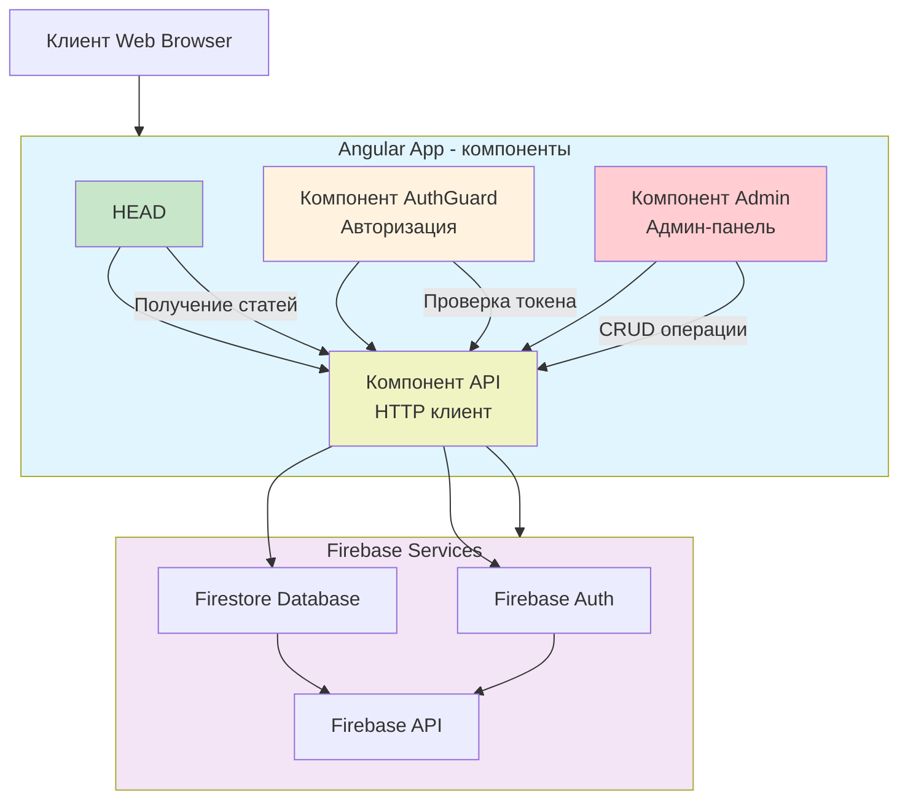

# Описание архитектуры MVP

Клиентское веб-приложение на Angular взаимодействует с облачной инфраструктурой Firebase через единый API-компонент. Все UI-компоненты (Head, AuthGuard, Admin) делегируют запросы к бэкенду через централизованный HTTP-клиент, обеспечивая согласованную обработку данных. Firebase обрабатывает аутентификацию через Auth Service, хранение данных в Firestore и бизнес-логику через Cloud Functions, возвращая результаты в Angular-приложение для отображения пользователям.

## Описание компонентов архитектуры MVP

### Компонентная структура Angular приложения:

**Head Component - главная страница:**
- Визуализация списка статей с пагинацией
- Фильтрация по категориям и тегам
- Поиск по содержимому статей
- Навигация к полному тексту статьи

**AuthGuard Component - управление доступом:**
- Получение и валидация JWT токена
- Редирект на страницу авторизации
- Защита маршрутов администратора
- Управление сессиями пользователей

**Admin Component - административная панель:**
- CRUD операции со статьями
- Редактирование контента в реальном времени
- Управление категориями и тегами
- Модерация контента

**API Component - слой взаимодействия с backend:**
- RESTful endpoints для статей
- Обработка HTTP запросов/ответов
- Кэширование данных
- Обработка ошибок

### Backend на Firebase:

**Firestore:**
- NoSQL база данных для хранения статей
- Хранение структурированных данных статей
- Реализация запросов для поиска и фильтрации
- Масштабируемое хранилище документов

**Firebase Auth:**
- Сервис аутентификации и авторизации
- Управление пользователями и ролями
- Генерация и валидация JWT токенов
- Интеграция с провайдерами авторизации

**Firebase API:**
- Облачные функции для бизнес-логики
- REST API endpoints для клиентских приложений
- Обработка CRUD операций с данными
- Интеграция между различными сервисами Firebase

