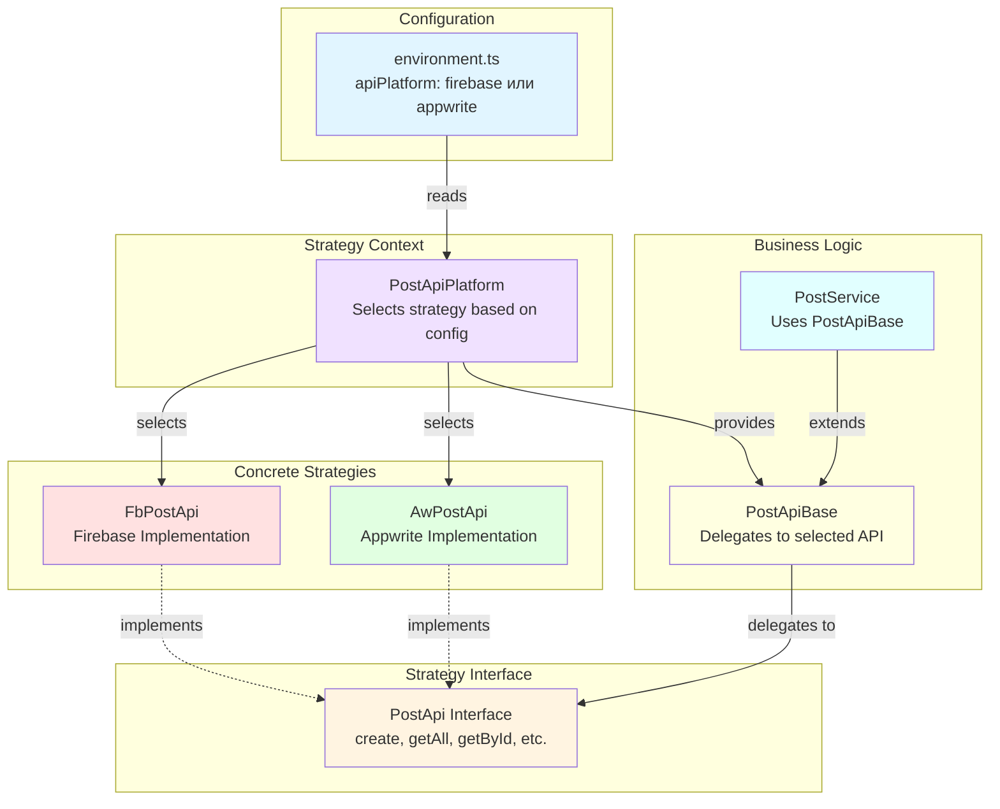

# API Architecture Documentation

## Архитектура

Архитектура использует паттерн **Strategy** для переключения между различными платформами API (Firebase и Appwrite). Это позволяет легко менять backend-платформу без изменения бизнес-логики приложения.

### Паттерн Strategy

Паттерн Strategy определяет семейство алгоритмов, инкапсулирует каждый из них и делает их взаимозаменяемыми. В нашем случае:

- **Стратегия** - это интерфейс API (например, `PostApi`)
- **Конкретные стратегии** - реализации для Firebase (`FbPostApi`) и Appwrite (`AwPostApi`)
- **Контекст** - платформенный класс (`PostApiPlatform`), который выбирает нужную стратегию

## Структура переключения

### 1. Конфигурация

Выбор платформы определяется в файлах окружения через параметр `apiPlatform`:

**`src/environments/environment.ts`** (development):
```typescript
export const environment: Environment = {
  // ... другие настройки
  apiPlatform: 'firebase', // или 'appwrite'
};
```

**`src/environments/environment.prod.ts`** (production):
```typescript
export const environment: Environment = {
  // ... другие настройки
  apiPlatform: 'firebase', // или 'appwrite'
};
```

### 2. Базовый интерфейс

Каждый API имеет базовый интерфейс, определяющий контракт для всех реализаций:

**`src/app/admin/shared/api/post/post.api.base.ts`**:
```typescript
export interface PostApi {
  create(post: Post): Observable<Post>;
  getAll(): Observable<Post[]>;
  getRecent(): Observable<Post[]>;
  getPopular(): Observable<Post[]>;
  getById(id: string): Observable<Post>;
  getByRange(ids: string[]): Observable<Post[]>;
  update(post: Post | string, data?: {}): Observable<Post>;
  remove(post: Post | string): Observable<void>;
}
```

### 3. Конкретные реализации

Для каждой платформы создается отдельная реализация интерфейса:

**Firebase реализация** (`src/app/admin/shared/api/post/firebase/fb.post.api.ts`):
```typescript
@Injectable({ providedIn: 'root' })
export class FbPostApi implements PostApi {
  private fbClient: firebase.database.Database;
  
  constructor(
    private http: HttpClient, 
    private hubService: HubService, 
    private firebaseService: FirebaseService
  ) {
    this.fbClient = this.firebaseService.database;
  }
  
  create(post: Post): Observable<Post> {
    // Реализация для Firebase
  }
  // ... остальные методы
}
```

**Appwrite реализация** (`src/app/admin/shared/api/post/appwrite/aw.post.api.ts`):
```typescript
@Injectable({ providedIn: 'root' })
export class AwPostApi implements PostApi {
  public databases: Databases;
  
  constructor(
    private aw: WebAppService, 
    private hubApi: AwHubApi
  ) {
    this.databases = aw.databases;
  }
  
  create(post: Post): Observable<Post> {
    // Реализация для Appwrite
  }
  // ... остальные методы
}
```

### 4. Платформенный класс (Strategy Context)

Платформенный класс выбирает нужную реализацию на основе конфигурации:

**`src/app/admin/shared/api/post/post.api.platform.ts`**:
```typescript
@Injectable({
  providedIn: 'root'
})
export class PostApiPlatform {
  public readonly platform: ApiPlatform;
  public readonly postApi: PostApi;

  constructor(
    private fbApi: FbPostApi, 
    private awApi: AwPostApi
  ) {
    this.platform = environment.apiPlatform;

    switch (this.platform) {
      case 'appwrite':
        this.postApi = awApi;
        break;
      case 'firebase':
        this.postApi = fbApi;
        break;
      default:
        this.postApi = awApi;
    }
  }
}
```

### 5. Использование в сервисах

Бизнес-логика использует платформенный класс, не зная о конкретной реализации:

**`src/app/admin/shared/services/posts.service.ts`**:
```typescript
@Injectable({ providedIn: 'root' })
export class PostService extends PostApiBase implements PostApi {
  constructor(
    private context: PostApiPlatform, 
    private idb: IdbService
  ) {
    super(context.postApi); // Передаем выбранную реализацию
  }
  
  // Используем методы базового класса, который делегирует вызовы
  getAllPosts(cashNumber: number = 5) {
    const list = this.getAll(); // Вызов идет через PostApiBase
    // ... остальная логика
  }
}
```

## Доступные API модули

Архитектура применяется к следующим модулям:

1. **Post API** - `PostApiPlatform`
   - Firebase: `FbPostApi`
   - Appwrite: `AwPostApi`

2. **Hub API** - `HubApiPlatform`
   - Firebase: `FbHubApi`
   - Appwrite: `AwHubApi`

3. **Consumer API** - `ConsumerApiPlatform`
   - Firebase: `FbConsumerApi`
   - Appwrite: `AwConsumerApi`

4. **Auth** - `AuthPlatform`
   - Firebase: `FbAuthService`
   - Appwrite: `AwAuthService`

## Как переключиться на другую платформу

Для переключения между Firebase и Appwrite достаточно изменить значение `apiPlatform` в файлах окружения:

1. Откройте `src/environments/environment.ts` (для development)
2. Измените `apiPlatform: 'firebase'` на `apiPlatform: 'appwrite'` (или наоборот)
3. Аналогично измените `src/environments/environment.prod.ts` (для production)
4. Перезапустите приложение

Все сервисы автоматически начнут использовать выбранную платформу без изменения кода бизнес-логики.

## Диаграмма архитектуры



## Преимущества архитектуры

1. **Легкое переключение** - изменение одной строки конфигурации переключает всю платформу
2. **Изоляция** - бизнес-логика не зависит от конкретной реализации
3. **Расширяемость** - легко добавить новую платформу (например, Supabase)
4. **Тестируемость** - можно легко мокировать API для тестов
5. **Единый интерфейс** - все платформы реализуют одинаковый контракт

## Структура файлов

```
src/app/admin/shared/api/
├── post/
│   ├── post.api.base.ts          # Интерфейс и базовый класс
│   ├── post.api.platform.ts      # Платформенный класс
│   ├── firebase/
│   │   ├── fb.post.api.ts        # Firebase реализация
│   │   └── models.ts             # Firebase модели
│   └── appwrite/
│       ├── aw.post.api.ts        # Appwrite реализация
│       └── models.ts             # Appwrite модели
├── hub/
│   └── [аналогичная структура]
├── consumer/
│   └── [аналогичная структура]
└── ...
```

