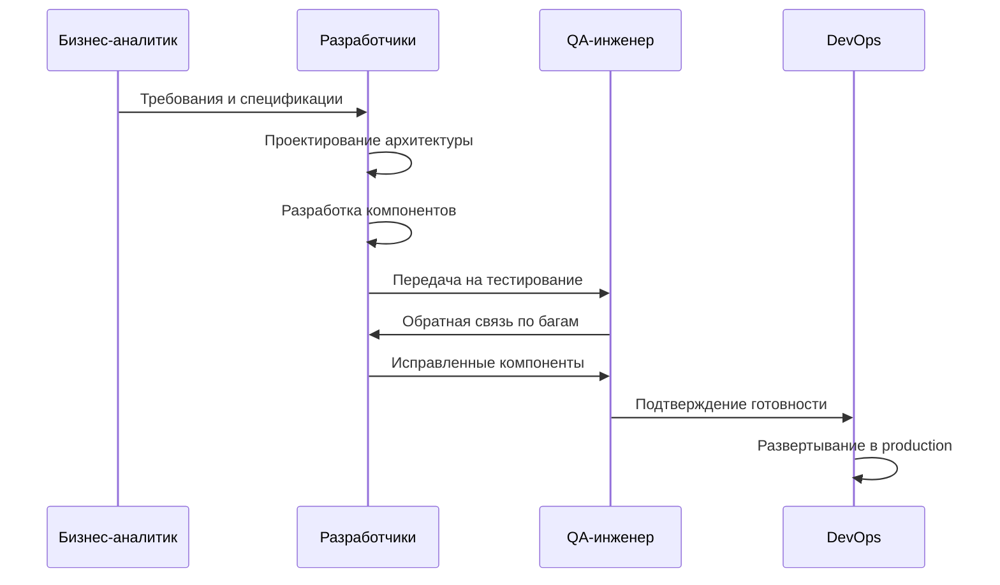
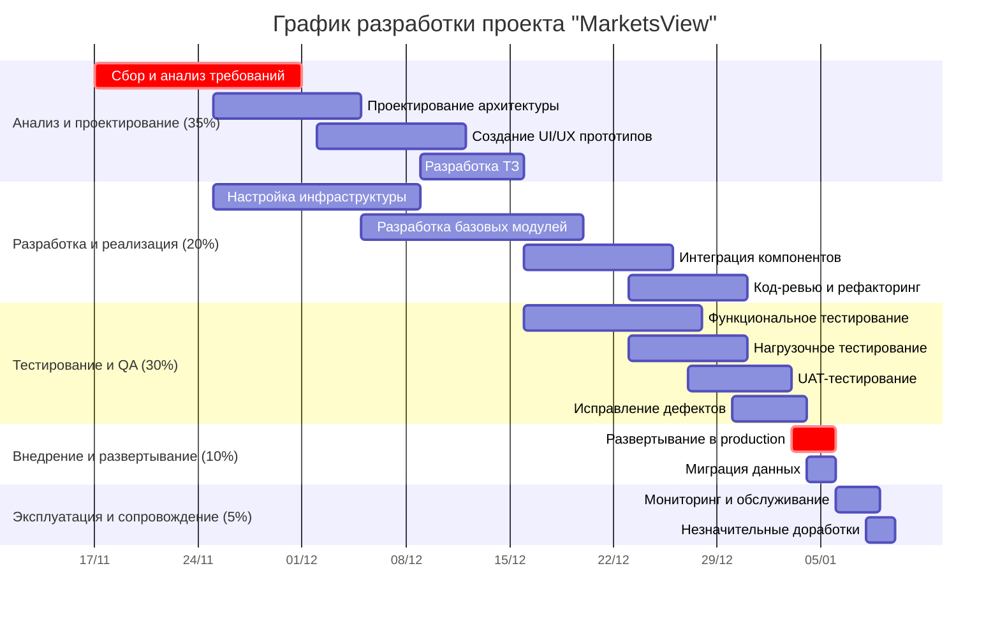

# **Отчет по управлению проектом "WebBlog": Этап планирования. Часть 2. План разработки программного продукта**

### **1. Процесс разработки программного обеспечения**

### **2. Документация проекта**

### **3. Диаграмма последовательности разработки**

### **4. Диаграмма Ганта**

### **5. Контроль соответствия ПО на каждом этапе**

Планирование качества

- Определение стандартов и метрик

- Создание чек-листов проверок

- Установление критериев приемки

Процессные проверки

- Регулярные код-ревью

- Статический анализ кода

- Проверка соответствия стандартам

Функциональное тестирование

- Модульное тестирование (Jest, Karma)

- Интеграционное тестирование

- Регрессионное тестирование

Нефункциональное тестирование

- Нагрузочное тестирование (JMeter)

- Тестирование безопасности

- Тестирование совместимости

Приемочное тестирование

- Тестирование пользователями

- Проверка критериев приемки

В итоге многоуровневая система контроля обеспечивает высокое качество продукта.

### **6. Управление версиями и релизами**

### **7. Проблемы планирования и рекомендации**
Выявлены ключевые проблемы и разработаны рекомендации:

- Технические сложности (интеграция компонентов, производительность)
Рекомендации: Прототипирование, нагрузочное тестирование на ранних этапах

- Управленческие вызовы (изменение требований, распределение команды)
Рекомендации: Гибкая методология, регулярная коммуникация, четкое распределение ролей

- Внешние факторы (изменение законодательства, рыночные условия)
Рекомендации: Регулярный мониторинг внешней среды, создание буферов в плане

- Методологические проблемы (сочетание waterfall и agile подходов)
Рекомендации: Четкое разграничение этапов, адаптация процессов под проект
В итоге проактивное планирование позволяет минимизировать влияние потенциальных проблем.

### **8. Заключение**
Разработан детализированный план разработки программного продукта проекта "WebBlog". Определены процессы разработки, документация и методы контроля качества. Внедрена система управления версиями и планирования релизов. Выявлены потенциальные проблемы и разработаны рекомендации по их решению. План обеспечивает стандартизацию процессов и предсказуемость результатов разработки. Результаты этапа служат основой для перехода к фазе реализации проекта.
решению. План обеспечивает стандартизацию процессов и предсказуемость результатов разработки. Результаты этапа служат основой для перехода к фазе реализации проекта.
