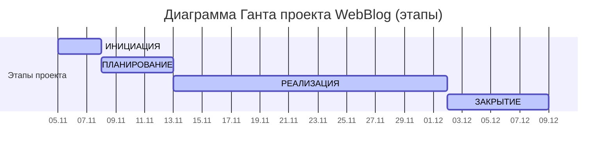

# **Отчет по управлению проектом «WebBlog»: Этап планирования. Часть 1. Общее планирование**

### 1. **Требования к проекту**

| Требования | Опишите требования высокого уровня |
|------------|-----------------------------------|
| **Функциональные требования** | • Публикация и редактирование статей • Поиск и фильтрация по тегам/категориям • Адаптивный интерфейс для мобильных устройств • Базовая административная панель |
| **Нефункциональные требования** | • Время загрузки страницы < 2 сек • Поддержка 1000+ одновременных пользователей • Кроссбраузерная совместимость (Chrome, Firefox, Safari) |
| **Предположения и ограничения проекта** | • Бюджет проекта согласован • Срок реализации — до 12.12.2026 • Команда имеет опыт работы с Angular и Firebase • Отсутствие законодательных барьеров для запуска |
| **Предварительное заявление о рисках** | • **Риск:** Несоответствие UI/UX ожиданиям пользователей   *Снижение:* Проведение A/B-тестирования на ранних стадиях • **Риск:** Задержки из-за недоступности ключевых разработчиков   *Снижение:* Формирование базы знаний и кросс-обучение в команде |
| **Сводный график вехи** | • Завершение сбора требований: 10.04.2026 • Полный дизайн ПО: 31.05.2026 • Полное кодирование: 15.09.2026 • Тестирование и отладка: 31.10.2026 • Внедрение: 30.11.2026 |

### **2. Основные этапы проекта**
Определены ключевые вехи, соответствующие жизненному циклу разработки программного обеспечения.

Таблица 2.1 – Детализация проекта - дорожная карта (roadmap)
| Веха | Описание |
|------|----------|
| Завершить сбор требований | Все требования к программному обеспечению должны быть определены, чтобы дизайн был основан на |
| Полный дизайн программного обеспечения | Это теоретический дизайн программного обеспечения и его функциональности. |
| Полное кодирование программного обеспечения | Все кодирование завершено, в результате был создан прототип программного обеспечения |
| Полное тестирование и отладка программного обеспечения | Вся функциональность протестирована, все выявленные ошибки исправлены |
| Полный переход программного обеспечения | Завершенное программное обеспечение и документация переданы в операционную группу для начала производства |

### **3. Команда проекта и организационная структура**
Сформирована проектная команда с распределением ролей и зон ответственности.
Таблица 3.1 – Командная разработка проекта

| Роль | Описание роли |
|------|---------------|
| Бизнес-аналитик | Сбор и анализ требований, написание пользовательских сценариев |
| Системный аналитик | Проектирование архитектуры, формализация технических требований |
| Тимлид (Team Leader) | Координация работы технической команды, принятие архитектурных решений |
| Бэкенд-разработчик | Разработка серверной части приложения, API и бизнес-логики |
| Frontend-разработчик | Разработка клиентской части приложения на Angular |
| Веб-программист | Реализация дополнительного функционала, интеграция компонентов |
| DevOps-инженер | Настройка CI/CD, развертывание и поддержка инфраструктуры |
| UX-дизайнер | Проектирование пользовательского интерфейса и пользовательского опыта |
| Маркетолог | Продвижение продукта, анализ рынка, работа с аудиторией |
| Технический писатель | Подготовка документации, руководств пользователя |

### **4. Иерархическая структура работ (WBS)**
Разработана детализированная структура работ, охватывающая все аспекты проекта.

**1. Инициация.**
- Сделать описание проекта
- Разработка и согласование устава проекта 
- Выявление ключевых стейкхолдеров 
- Определение бизнес-требований и целей MVP 
- Первичная оценка рисков и ограничений

**2. ПЛАНИРОВАНИЕ (10.11 - 14.11)**
- Создание Product Roadmap
- Разработка UI/UX дизайна и прототипов
- Планирование технической архитектуры
- Формирование бэклога разработки
- Утверждение плана проекта 
- 
**3. РЕАЛИЗАЦИЯ (17.11 - 05.12)**
- Реализация бэкенд-функциональности (API, БД)
- Разработка фронтенд-компонентов
- Интеграция фронтенда и бэкенда
- Тестирование функциональности
- Подготовка к релизу
- 
**4. ЗАКРЫТИЕ (08.12 - 12.12)**
- Проведение приемочного тестирования 
- Деплой на продакшн-сервер 
- Финализация документации 
- Проведение ретроспективы проекта 
- Оценка достижения целей проекта 
- Формальное закрытие проекта и отчетность

### **5.Ролевое участие в проектных этапах**

Таблица 5.1 Лента участия  в проекте
___
| Роль | Инициация | Планирование | Реализация | Завершение |
|------|-----------|-------------|------------|------------|
| **Руководитель проекта** | 40% - Формирование устава, идентификация стейкхолдеров, оценка жизнеспособности | 30% - Разработка плана проекта, распределение ресурсов, определение вех | 20% - Мониторинг прогресса, управление рисками, коммуникация | 10% - Финальная отчетность, закрытие проекта, извлечение уроков |
| **Бизнес-аналитик** | 30% - Анализ бизнес-требований, формирование видения продукта | 40% - Детализация требований, создание PRD, приоритизация функций | 20% - Уточнение требований, приемочное тестирование | 10% - Участие в ретроспективе, передача знаний |
| **Системный аналитик** | 10% - Предварительная оценка технической осуществимости | 50% - Декомпозиция требований, проектирование процессов, создание спецификаций | 30% - Уточнение ТЗ, поддержка разработчиков | 10% - Финализация документации |
| **Тимлид (Team Leader)** | 10% - Участие в оценке трудозатрат и рисков | 30% - Техническое проектирование, распределение задач в команде | 50% - Руководство разработкой, код-ревью, решение технических проблем | 10% - Участие в ретроспективе, оценка результатов команды |
| **Backend-разработчик** | 5% - Консультации по выбору технологий | 20% - Проектирование архитектуры БД, API | 70% - Реализация серверной логики, интеграции | 5% - Документирование кода, передача знаний |
| **Frontend-разработчик** | 5% - Консультации по UI/UX возможностям | 25% - Проектирование компонентной архитектуры | 65% - Разработка интерфейса, интеграция с API | 5% - Рефакторинг, документация |
| **Веб-программист (Full-stack)** | 10% - Оценка full-stack решений | 20% - Проектирование вспомогательных систем | 60% - Разработка лендинга, админки, интеграций | 10% - Финальная доработка, багфиксы |
| **DevOps-инженер** | 5% - Оценка инфраструктурных требований | 35% - Настройка CI/CD, проектирование инфраструктуры | 50% - Поддержка процессов, мониторинг, оптимизация | 10% - Документирование инфраструктуры |
| **UX-дизайнер** | 15% - Исследование пользователей, конкурентов | 50% - Создание дизайн-системы, прототипов, макетов | 30% - Поддержка разработки, адаптация дизайна | 5% - Формирование гайдлайнов |
| **Маркетолог** | 20% - Анализ рынка, целевой аудитории | 30% - Разработка маркетинговой стратегии, контент-плана | 40% - Подготовка материалов, запуск кампаний | 10% - Анализ результатов, отчетность |
| **Технический писатель** | 5% - Оценка объема документации | 25% - Проектирование структуры документации | 60% - Создание руководств, инструкций, справки | 10% - Финальная редактура, публикация |

---

**Примечания:**
- Проценты указаны относительно общего времени участия роли в проекте
- Распределение может варьироваться в зависимости от специфики проекта
- На этапе Реализации предполагается активная ежедневная работа
- Этап Завершения включает финализацию, документирование и передачу продукта

### **6.Диаграмма Ганта**
Построен визуальный график выполнения работ, определяющий общий срок реализации проекта.

Общий срок выполнения проекта: с 05.11.2025 по 12.12.2025 (37 календарных дней).
В итоге диаграмма Ганта наглядно демонстрирует timeline проекта и взаимосвязи задач.

### **7. Итоги этапа планирования**
Выполнены все пункты задания: сформулированы требования, определены вехи, распределены роли в команде, построены WBS и диаграмма Ганта. Установлены реалистичные сроки выполнения работ с учетом зависимостей между задачами.
Таким образом, создан комплексный план управления проектом, готовый к утверждению спонсором.

