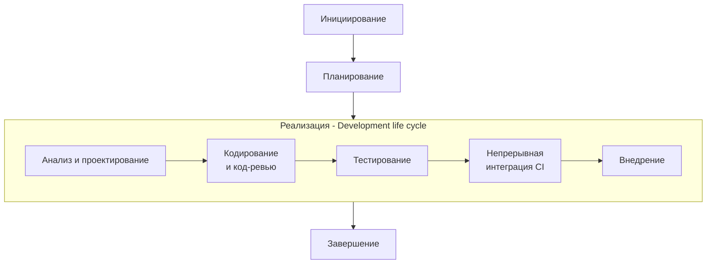

# **Этапа 3. Реализации проекта "WebBlog"**

### **1. Введение в этап реализации**
- **Общая характеристика**: Ключевая фаза жизненного цикла проекта
- **Сроки выполнения**: 01.06-15.09.2026 (107 календарных дней)
- **Основная цель**: Преобразование проектных спецификаций в рабочий программный продукт
- **Методология**: Гибридный подход (Scrum + Waterfall)

### **2. Организационная структура этапа**

### 3. Детализация процессов реализации

#### 3.1. Проектирование (16.03-31.05.2026)
**Проектирование архитектуры:**
- Разработка микросервисной архитектуры
- Проектирование REST API
- Создание схемы базы данных
- Документирование архитектурных решений

**Проектирование БД:**
- Проектирование моделей данных
- Оптимизация запросов
- Планирование миграций
- Резервное копирование и репликация

**UI/UX проектирование:**
- Создание интерактивных прототипов
- Разработка дизайн-системы
- Адаптация под мобильные устройства
- Тестирование юзабилити

#### 3.2. Разработка (01.06-31.08.2026)
**Разработка API:**
- Реализация endpoints для статей и пользователей
- Интеграция системы аутентификации
- Реализация поиска и фильтрации
- Оптимизация производительности

**Разработка фронтенда:**
- Верстка компонентов на Angular
- Реализация реактивных форм
- Интеграция с API
- Оптимизация загрузки

**Интеграция компонентов:**
- Сборка приложения
- Настройка взаимодействия
- Решение конфликтов
- Кросс-браузерное тестирование

#### 3.3. Тестирование (01.09-15.09.2026)
**Модульное тестирование:**
- Покрытие кода unit-тестами
- Тестирование отдельных компонентов
- Валидация бизнес-логики
- Измерение покрытия кода

**Интеграционное тестирование:**
- Тестирование API endpoints
- Проверка взаимодействия компонентов
- Тестирование сценариев использования
- Валидация данных

### 4. Процессы контроля качества
- Ежедневные стендапы
- Еженедельные код-ревью
- Непрерывная интеграция (CI/CD)
- Регулярное демо для стейкхолдеров
- Статический анализ кода
- Автоматизированное тестирование
- Мониторинг метрик качества

### 5. Критерии завершения этапа
- Реализован весь запланированный функционал
- Успешно пройдены все виды тестирования
- Документация актуализирована
- Получено одобрение product owner
- Код соответствует стандартам качества
- Выполнены нефункциональные требования
- Готовность к переходу на этап внедрения

 

**Таким образом, этап реализации** представляет собой структурированный процесс преобразования требований в рабочий продукт с постоянным контролем качества.