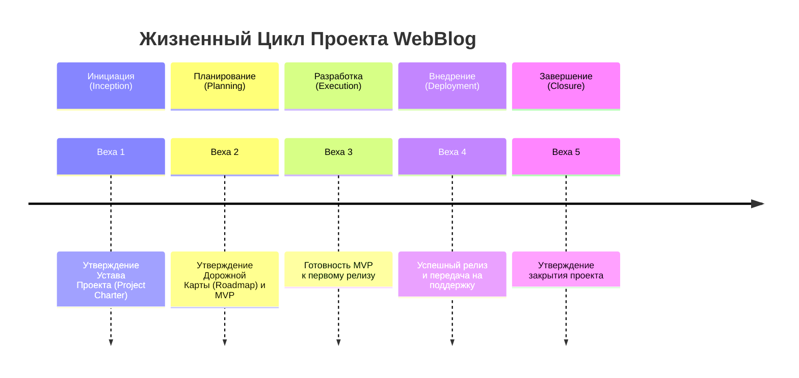

# WebBlog: База знаний проекта

Это — центральный хаб всей информации о проекте WebBlog. Здесь хранится документация, принятые решения и процессы.

**WebBlog** представляет собой полный цикл создания цифрового продукта — от проектирования архитектуры до развертывания готового решения. Это современное веб-приложение, сочетающее инновационные подходы к разработке с ориентированностью на реальные потребности пользователей в качественной публикации и потреблении контента.

## 🗺️ Жизненный цикл проекта
Данный документ описывает ключевые этапы и контрольные точки проекта, обеспечивая прозрачность управления и четкое видение прогресса для всех участников. Следующие вехи определяют логику развития проекта от инициации до полного завершения работ.

# Жизненный цикл проекта WebBlog: Ключевые Вехи

---

#### **Фаза 1: ИНИЦИАЦИЯ (Inception)**
**Цель:** Подтверждение целесообразности проекта и его границ.

**Ключевые результаты:**
1. **Устав проекта (Project Charter):** Документ, официально запускающий проект. Содержит:
   - Бизнес-кейс (решаемая проблема, цели, задачи)
   - Формулировка целей (SMART)
   - Ключевые стейкхолдеры (Product Owner, спонсор (заказчик) - в нашем случае Проектива)
   - Высокоуровневые риски и бюджет
   - Назначение Project Manager
2. **Предварительный анализ стейкхолдеров**
3. **Формулировка Видения продукта (Product Vision)**

**🎯 Веха 1: Утверждение Устава проекта спонсором.** Без этой вехи проект не должен получать ресурсы.

---

#### **Фаза 2: ПЛАНИРОВАНИЕ (Planning)**
**Цель:** Создание детального плана, как будут достигнуты цели.

**Ключевые результаты:**
1. **Дорожная карта продукта (Product Roadmap):** High-level план развития продукта на 6 месяцев (семестр)
2. **Определение MVP (Minimum Viable Product):** Согласование списка функций для первой версии (минимальный функционал)
3. **План управления проектом:** Включает планы по содержанию, срокам, затратам, качеству, рискам, коммуникациям
4. **Дизайн-концепция и архитектурный эскиз.** Основные технологии, структура, ключевые компоненты
5. **Детальный план-график (Schedule)** с вехами и зависимостями
6. **План ресурсов и бюджета**

**🎯 Веха 2: Утверждение Дорожной карты, MVP и Бюджета спонсором и Product Owner.** Команда получает четкий мандат на выполнение.

---

#### **Фаза 3: РАЗРАБОТКА И ИСПОЛНЕНИЕ (Execution & Monitoring)**
**Цель:** Создание продукта в соответствии с планом, контроль исполнения.

**Ключевые результаты:**
1. **Работающий программный продукт, MVP,** собранный по итогам спринтов
2. **Регулярные (би-)недельные сборки** с тестируемым функционалом
3. **Регулярный мониторинг:** Отслеживание выполнения графика, бюджета, качества (KPI: скорость разработки, количество багов)
4. **Управление изменениями:** Процесс обработки изменений в требованиях (Change Request)
5. **Регулярная отчетность для стейкхолдеров**

**🎯 Веха 3: Готовность MVP к первому релизу.** Все ключевые функции MVP реализованы, протестированы и стабильны. Получено разрешение на деплой.

---

#### **Фаза 4: ВНЕДРЕНИЕ И ЗАПУСК (Deployment & Release)**
**Цель:** Успешный вывод продукта в production-среду и передача на поддержку.

**Ключевые результаты:**
1. **Развернутое и работающее приложение** на продакшн-хостинге
2. **План развертывания (Deployment Plan)** и отката (Rollback Plan)
3. **Завершение приемочного тестирования (UAT - User Acceptance Testing)**
4. **Обучение пользователей (инструкция) и техническая документация**
5. **План перехода на поддержку (Transition Plan)**

**🎯 Веха 4: Успешный релиз и передача продукта на поддержку.** Продукт доступен пользователям, команда поддержки готова к работе.

---

#### **Фаза 5: ЗАВЕРШЕНИЕ (Closure)**
**Цель:** Формальное закрытие проекта, фиксация уроков.

**Ключевые результаты:**
1. **Итоговая отчетность** по проекту (достигнутые цели, итоговый бюджет, выполненные работы)
2. **Анализ извлеченных уроков (Lessons Learned):** Проведение ретроспективы с командой и стейкхолдерами
3. **Архивация проектной документации**
4. **Освобождение проектных ресурсов** и формальное закрытие контрактов (если были)
5. **Празднование успеха**

**🎯 Веха 5: Формальное утверждение закрытия проекта спонсором.** Проект официально завершен.

## 🔗 Быстрые ссылки
- [Устав проекта (Project Charter)](/Проектирование/1.%20Инициализация/charter.md)
- [Дорожная карта (Roadmap)](/Проектирование/2.%20Планирование/roadmap.md)
- [Техническое задание и требования](/requirements/)
- [Архитектура и технические решения](/architecture/)
- [Гайдлайны и стандарты разработки](/guidelines/)
- [Полезные ресурсы и контакты](/resources.md)

--- 
*Последнее обновление: {Дата}*